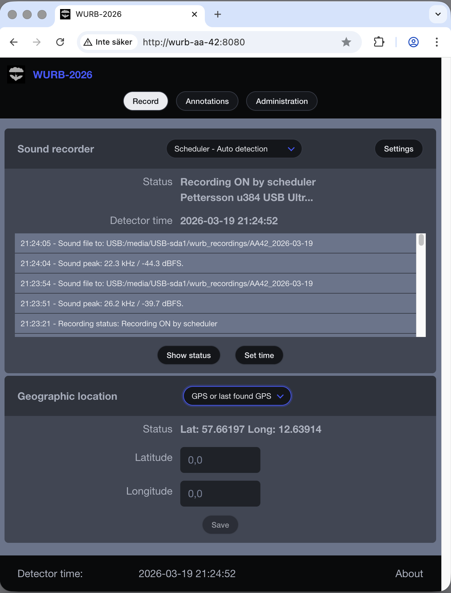
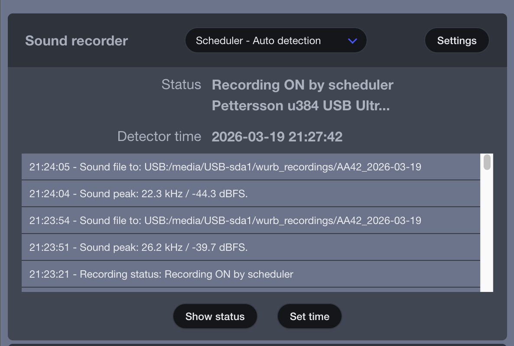
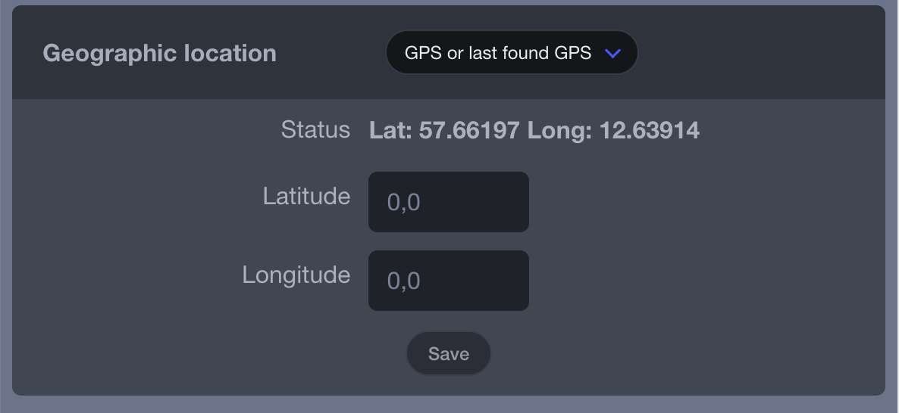
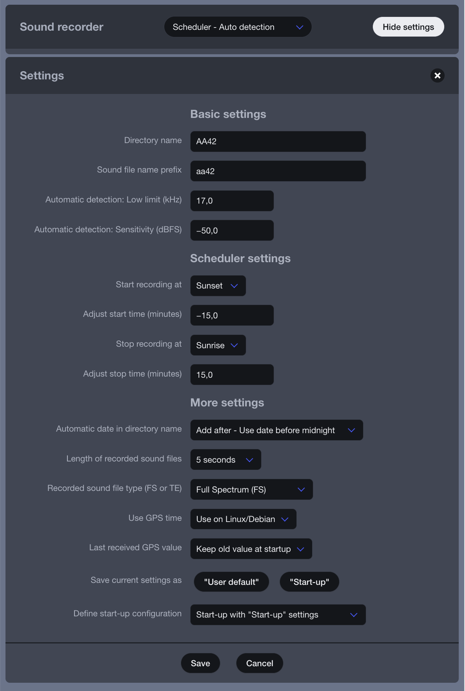
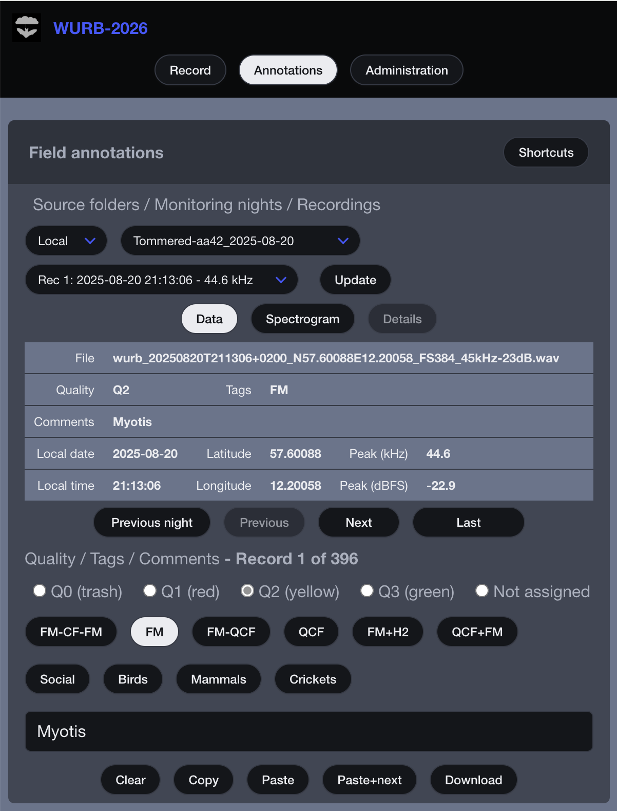
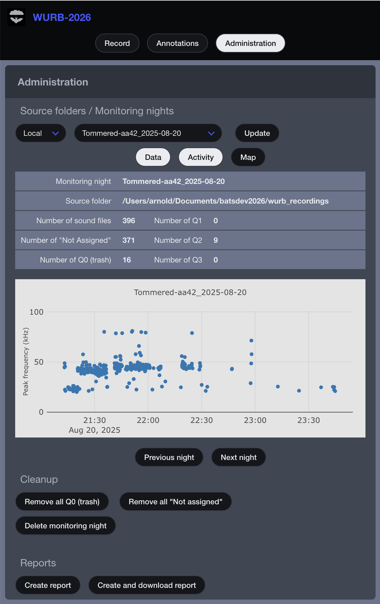
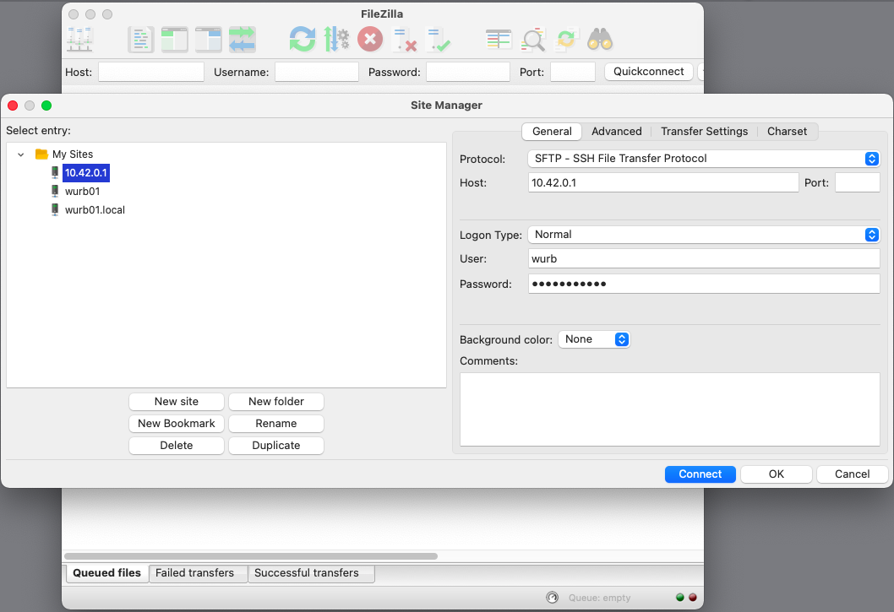

# WURB-2026 User manual

Welcome to the user manual for the Do-It-Yourself bat detector WURB-2026.

This document describes how to run the bat detector and how the
graphical user interface is organized.

Since the WURB detector is a DIY system you have to buy and assembly the
hardware parts yourself, and also install the software needed.
The detector is based on the Raspberry Pi minicomputer,
and if you want to know about what hardware that can be used when building
your own detector you should take a look in this document:
[Raspberry Pi basics](./raspberry_pi_basics.md)

The software and installation instruction can be found here:
<https://github.com/cloudedbats/wurb_2026>

## How to start the user interface

If the detector is built as described in the installation instructions,
just plug in power to start it. Then wait while it boots up.
The Raspberry Pi 5 has an on/off button, but earlier models do not,
so these must be turned off by cutting the power.

The WURB detector is not equipped with a screen or similar.
Instead it works as a web server and the user interface can run with any
web browser that runs on any computer or mobile phone/tablet that has
access to the detector.

The examples below assumes that your detectors hostname is "wurb01".

### Local network

When the detector is connected to your home network the detectors IP address
will be resolved by mDNS if ".local" is added to the host name.
The WURB web server use port 8080 and
the address in the web browser should look like this:

    http://wurb01.local:8080

### Hotspot mode

If the detector is running in hotspot mode, as described in the installation
description, it will work as follows.

From your computer/mobile phone/tablet check if there is a WiFi network
named "WiFi-wurb01" available.
Connect to it and enter the password "chiroptera".

The detector will use the IP address 10.42.0.1 and you have to use that since
there is no mDNS alternative for this IP address.
The address in the web browser should look like this:

    http://10.42.0.1:8080

### Remote access

If the detector is remotely deployed there are different alternatives to access
it on distance.
Check the [Raspberry Pi basics](./raspberry_pi_basics.md)
document and search for "Tailscale".

## The user interface

On the top there are three buttons used for navigation between the detectors three
main modules.
They are:

- **Record.**
This is the module where you set up the detector to record sound files.
It is divided into two parts.
One part is for the microphone and another part is for GPS location.

- **Annotations.**
In this module you can check each recorded file and also assign some annotations
at the same time as the detector records new files.
In some way it looks like a post processing tool,
but it is just meant to be a light version to be used when out in the field.

- **Administration.**
If you have used the annotations module, then there is this module with the
focus on monitoring nights instead of single sound files.
Files marked as trash can be removed and an Excel report can be generated based
on the information that is provided in the previous module.
There is also one diagram and one map that can show when and where there has
been activity during the night.

## Module "Record"

**Important**: If the detector is running in hotspot mode you must press the
button **Set time** when the detector is started up.

Otherwise the time will be set from the time value stored at last shutdown.
If the detector can reach internet, then time will be set automatically,
but this is not the case when running in hotspot mode.
Time is also set properly if a GPS unit is attached, but that may take some time
and will only happen when the GPS unit lock on to a specified number of satellites.

Another important thing is to always have a **default position** registered in
the system.
This can be done manually and they are expressed as latitude / longitude in the
decimal-degree format, for example longitude = 15.00 degrees for the central
meridian in Sweden.
This position is needed for the scheduler to calculate sunset, sunrise, etc.
even when a GPS unit fails to deliver the right position.

 

### Sound recorder

#### 1: Detector modes

The detector can be used for both active and passive monitoring.
To make it easy to switch between different modes of usage there is a list of
available options.
There are also some additional options where you can load predefined settings,
and shut down or restart the detector.

 

Mode options are:

- **Microphone - Off**
In this mode the detector is on but the sound stream from the microphone is
turned off.

- **Recording - On (continuously)**
Recording is on and all sound will continuously be saved to files.
The file length will still be as specified, for example 5 seconds, and no sound
frames will be lost
between the files if they are to be concatenated into bigger files later.

- **Recording - Auto detection**
This mode can be used for both active and passive monitoring.
The recording is started when sound is detected, see settings below for more details.
A one second prefetch buffer before the triggering event will be saved,
and then the recording will last until the specified file length is reached.
If needed, the recording will continue and result in more files, all of them with
the same length.

- **Recording - Manual triggering**
This is mainly used for active monitoring.
A button with the text "Trigger" will appear.
The same prefetch buffer as for auto detection is used.

- **Scheduler - Recording on**
The detector can calculate when sunset, dusk, dawn and sunrise occur if a
position expressed in latitude/longitude is available and the correct time is set.
This makes it possible to let the detector automatically adjust the start and stop
times for recordings when it is deployed for passive monitoring during longer periods.
Except for this it works in the same way as "Recording - On (continuously)"
described above.

- **Scheduler - Auto detection**
This is mainly the same as "Recording - Auto detection" but it is started and
stopped related to the scheduler settings.

- **Load "User default" settings**
It is possible to save settings as "User default".
When selecting this mode the detector is set to this state.
More info on how to save this "User default" setting in the settings section below.

- **Load "Start-up" settings**
This is another option similar to the previous one.
The only difference is that this one can be defined as the state the detector
should have when started.

- **Load "Factory default" settings**
This is used to restore the detector to its initial state.
It will not change the stored "User default" and "Start-up" settings.
It is then easy to go back to either "User default" or "Start-up" later if
they are stored.

- **Detector - Power off**
Three buttons will appear: "Shutdown", "Restart" and "Cancel".
These choices will only work if the detector is running on a computer with
the Debian operating system that is normally used on the Raspberry Pi.

#### 2. Status

USB microphones can be attached and removed without turning the detector off.
Each time a recording session is activated, then the detector will scan for
connected microphones.
The name of the used one will be displayed here.

Check the [Raspberry Pi basics](./raspberry_pi_basics.md) document
for a list of directly supported microphones.

#### 3. Info log /  show status

This logging table displays the same information that can be found in the log
files located in the detectors internal file system.
Most useful are the rows that tells when sound is detected and the peak
frequency/strength for that sound.
This frequency/strength information will also be stored in the file names of the
recorded files, but it may differ if a stronger sound was detected after the
triggering event.

By pressing **Show status** some more info can be displayed in the info log.

#### 4. Detector time

There is a button called **Set time**.
It is important to press this button to use the time from the client
computer/mobile phone to set the detector time if the detector is
running in hotspot mode.

The Raspberry Pi does not contain an internal clock module and must rely on
external sources for that.
If it is connected to internet, then the time will be set from internet at startup.
If an USB GPS receiver is used, then time will be set automatically 30 sec
after it has locked in the satellites.
If none of the above is in place, then you have to do this manually by
pressing "Set time" each time after startup.

### Geographic location

It is important to know where and when a recording is made,
and therefore the detector has support for a GPS receiver.
This is optional, but recommended, and it also solves the problem with the missing
internal clock module in the Raspberry Pi since the GPS signals also includes
timestamps.

Each recorded file has a filename that contains both time and location.
This makes it easy to find recordings on your hard disks by searching for parts
of the date and time or latitude/longitude strings.
This feature also makes it easy to use the detector for transect monitoring.

In addition to the position being saved for each audio recording,
there is also a file that is stored with the night's recordings where the
position for each minute is noted.
This minute log can also be found in the Excel report described below.

 

There are three different modes available:

- **Default position.**
Use this if you want to use the scheduler and/or tag the files without using
a GPS receiver.
It is recommended to use two or three decimals for manually entered positions
to distinguish them from
the more exact GPS received positions.

- **GPS.**
In this mode you will either get the position from the GPS unit,
or the default position.
Note that if the default position is set to 0.0/0.0 and the GPS fails
to get a GPS position, then the scheduler will stop recordings.

- **GPS or Last found GPS.**
This is probably the best alternative to use for many use cases.

In the detector settings you can define whether the "Last found GPS"
should be saved from the last session or cleared at startup.
If it is cleared the default position will be used as fallback position.

This alternative is also useful if you have many detectors, but only one GPS receiver.
Connect the GPS receiver during deployment and wait until the position is found
and time is set from GPS.
Then the GPS receiver can be removed and be used to deploy the next detector.

### Modify settings

#### 1. Settings - Basic

This part contains settings that can be modified at each deployment.
You can modify:

- The name of the directory where recorded files are stored.
- The prefix for each sound file.
- The lower limit in kHz for the sound detection algorithm.
- The sensitivity level in dBFS for the sound detection algorithm.

The sensitivity level is expressed as dBFS. This is a decibel scale
where 0 is the max value at the point where the signal starts to distort.
Then the values are negative. -50 dBFS is used as default, -40 will give
less recorded files and -60 dBFS more recorded files.

#### 2. Settings - Scheduler

The scheduler needs proper time and position to be able to calculate when the
sun goes down and up.
It is activated when the detector mode is either "Scheduler - Recording on" or
"Scheduler - Auto detection"
and the values for latitude and longitude differ from zero.
Be sure that the time also is properly set.

It is possible to define one start event and one stop event for each night.
Either at fixed times or in relation to sunset, dusk, dawn and sunrise.

#### 3. Settings - More

This set of settings are normally not modified that often.
Available settings are:

- If date should automatically be added to the directory name where recorded
files are stored.
- The length of the recorded sound files. Valid values are 4 - 60 sec.
- Recorded file type; Full Spectrum (FS) or Time Expansion (TE) where 10x is
the only option.
Note: Both alternatives contains the exact same amount of samples,
the only difference is in the header part that tells which sampling frequency
that was used.
For example 384 kHz in FS mode uses 38.4 kHz in TE mode. The sound will then be
played in slow-motion.
- If time should be set from GPS when using a Raspberry Pi.
- If "Last found GPS" value is to be cleared or reused from earlier session at startup.
- Then there are two buttons and a possibility to select the start-up
configuration.
The buttons **User default** and **Start-up** are used to save settings that
are easily available in the detectors mode selection list.
- The last setting is whether the detector should retain its settings from the
previous session or whether the "Start-up" settings should be used at start up.

 

## Module "Annotations"

Here are some reasons why this module exists:

- It's nice to be able to check what was recorded right away without having to
wait until the next day.
- It is good to check that everything is okay before leaving the detector for
the rest of the night.
- If you are looking at a spectrogram, it is more efficient to make some notes
immediately. For example, junk recordings can be marked as Q0 and deleted immediately.
- For stationary detectors that can be accessed remotely, this feature
is particularly good to have.

 

### Navigation - sources, directories and files

Here you can select where the recorded files are stored.
"Local" is for files stored on the detectors micro SD card and "USB-1"/"USB-2"
are used for attached file storage units.

Then there is a list of directories, one for each monitoring night.
And finally a list of recordings for the selected night.

### Data and spectrogram

There are currently two options for visualization.
Either metadata or the spectrogram.
Note that the spectrogram is a simple viewer and you cannot zoom into it.

### Quality, tags and comments

There are some alternatives for annotations, use them as you want.
If an Excel report is generated in the Administration module all
annotations will be a part of that report.

The quality tags "Q0" and "Not assigned" can be removed in the
Administration module.

### Shortcuts

There are some shortcuts available that are handy to have.

## Module "Administration"

The Annotations module is focusing on single recorded files.

In this Administration module focus is on recording nights,
and the goal is to give an overview of each night.

 

### Navigation - sources and directories

This is similar to the Annotations module, but without the "Recordings" part.

### Data, activities and map

It is always important to know where and when there was activity during
the night.
Here you can check that as an activity diagram and on a map.
Not that the map is only visible if the web browser is connected to internet.

### Cleanup

Here you can remove files marked as "Q0" or "Not assigned".
It is also possible to remove monitoring nights.

Another more effective way to remove monitoring nights and files
is described in the "File management" section below.

### Excel report

An Excel report can be generated with both annotations and other metadata
for each recorded file.

## File management

There are two main ways to move recorded audio files to a computer
for post-processing. The most obvious is to record them to an external
USB flash drive and then move that device to the computer.

The other way is to use the SFTP protocol for transfer.
There are two free SFTP clients that can be recommended:

- **FileZilla** for Windows, macOS and Linux.
- **WinSCP** for Windows.

In the FileZilla example you can use the button in the upper left
corner (Site Manager) to register a list of detectors.
Enter this information for each connection:

    Protocol: SFTP
    Host: wurb01
    User: wurb
    Password: your-secret-password

Replace Host: "wurb01" with "wurb01.local" if on your local network or
the IP address 10.42.0.1 if it is accessed in hotspot mode.

 

Then there are three directories located at the detectors SD card
that are of interest:

- /home/wurb/wurb_recordings
- /home/wurb/wurb_logging
- /home/wurb/wurb_settings

If external USB flash drives are used their content can be found here:

- /media/USB-sda1/
- /media/USB-sdb1/

## Advanced topics

There are three main protocols used to access the WURB detector.

- **HTTP** is used for the web-based user interface.
- **SFTP** is used for file access via an SFTP client.
- **SSH** is used for access via a terminal window.

This advanced section is mainly targeting users that are familiar with
Linux commands and knows how to use a terminal window.

Please note that SSH and SFTP both are password protected, but HTTP is not.
If you are planning to publish HTTP you should consider to add another layer
with for example nginx and add a user/password login there.

For SSH start a terminal window and then type:

    ssh wurb@wurb01.local  # If it is connected to the local network.
    ssh wurb@10.42.0.1     # If it is running in hotspot mode.

### Settings and configuration

There is a difference between settings and configuration.
Settings is something that the user can modify when the system is up and running.
Configuration is something that is done at system startup.
Some parts of the configuration system is on a more technical level and should
only be modified
by users with an understanding of how the software works.

In the WURB system settings are stored in a small database and configuration is
stored in a YAML-file.
Both can be found in the directory "wurb_settings".

    /home/wurb/wurb_settings/wurb_settings.db
    /home/wurb/wurb_settings/wurb_config.yaml

#### Settings

There are four sets of settings stored in the database and they can be loaded in
the Record module.
They are described earlier in this document and they are "Current settings",
"User default setting", "Start-up settings" and  "Factory default settings".

If there are problems, or if you want to do a reset to factory settings/configuration,
then the easiest way is to just remove the wurb_settings directory and restart.

    cd /home/wurb
    rm -r wurb_setting

#### Configuration

Configurations are stored in a YAML file.
YAML is similar to the JSON format, but you don't have to write that
many characters like {, }, ", [ and ].
YAML is like JSON, but for humans.

It is located here: /home/wurb/wurb_settings/wurb_config.yaml
and if it is missing at start up it will be created from this file
/home/wurb/wurb_2026/wurb_config_default.yaml

The reason is that if it is modified by a user, then the version
that is stored outside the Git controlled area will remain
after a "git pull" command.

#### Add a new microphone

There are many types of microphones registered in the configuration file,
but if you have a new model you can do this to add them to the list of
automatically identified ones.

1. Connect the new microphone to the detector.
2. Start the detector.
3. Check the debug log file and look for connected microphones.
4. Add a part of the description to the configuration file.

Example part from the debug log file:

    cat /home/wurb/wurb_logging/wurb_debug_log.txt

    : Welcome to CloudedBats WURB-2026
    : Project: https://github.com/cloudedbats/wurb_2026
    : ====================== ^ö^ ======================
    : WURB - main. Startup settings. 
    : WURB - main. Startup core. 
    : Connected microphones at startup: 
    : - Bat_Detector_USB_384kHz: USB Audio (hw:4,0)   MONO at 384000.0 Hz  

Example part from the configuration file.
The "Bat_Detector" is already there:

    cat /home/wurb/wurb_settings/wurb_config.yaml

    : audio_capture:
    : - device_name: Pettersson
    : - device_name: UltraMic : For Dodotronic.
    : - device_name: PIPPYG
    : - device_name: Bat_Detector
    : - device_name: AudioMoth
    :   sampling_freq_hz: 384000

#### Add a new GPS receiver

This is similar as the above example, but check for
"Connected serial devices" in the debug log file and
"gps_device_whitelist" in the configuration file.

#### Change directories used for recorded files

It is possible to change the directories used for recorded files,
both for where to put them when recorded and also for where to
look for them in the Annotation and Administration modules.

Example part from the configuration file.

    cat /home/wurb/wurb_settings/wurb_config.yaml

    : record:
    :   targets:
    :     - id: sda1
    :       name: USB-1
    :       os: Linux
    :       media_path: /media/USB-sda1
    :       rec_dir: wurb_recordings
    :     - id: sdb1
    :       name: USB-2
    :       os: Linux
    :       media_path: /media/USB-sdb1
    :       rec_dir: wurb_recordings
    :     - id: local
    :       name: Local
    :       executable_path_as_base: true
    :       rec_dir: ../wurb_recordings
    :       free_disk_limit: 500 # Unit MB.

There are also some commented sections that may be useful if the WURB software
is running on a desktop/laptop computer.

#### WURB software update

If you want to update the WURB-2026 software to the latest version,
then follow this instruction.

    # Always start with this.
    sudo apt update
    sudo apt upgrade -y
    # Move to where the software is installed.
    cd /home/wurb/wurb_2026
    # Activate the virtual python environment.
    source venv/bin/activate
    # Get the latest version from GitHub.
    git pull
    # Check if there are new python modules needed.
    pip install -r requirements.txt
    # And then finally restart the detector.
    sudo reboot

If there are problems try to reset it to factory settings
and restart again.

    cd /home/wurb
    rm -r wurb_setting

If there still are problems, then I recommend a complete reinstallation.
This should always be done when there are new major releases of the
Debian operation system.

## And finally...

If you find a solution to a problem, let me know.
If it was a problem for you, it will probably be a problem for
other users. And together we can help both users and bats.

## Contact

Arnold Andreasson, Sweden.

<info@cloudedbats.org>
